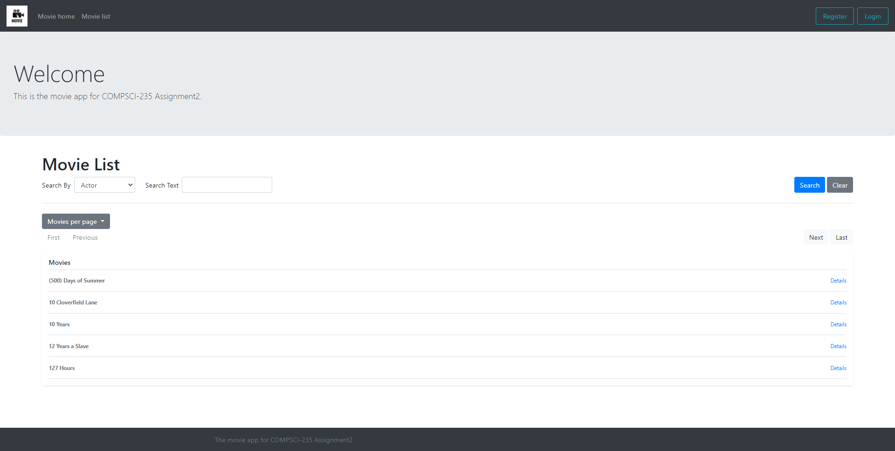
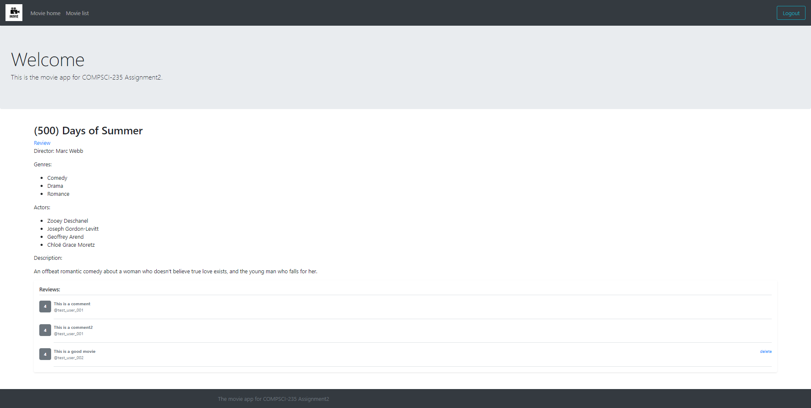

# CS235 -- Assignment 2

### Movie list page -- adjustable movies per page and fuzzy search feature

**Introduction:**

User can browse movies through the tab `Movie list`, which doesn't require user to login. In the below screen shot for the movie list page, we can see several different functionalities implemented in this page:

- There is a list of movies, depends on which value the user chose for `Movies per page`, the list will display different number of movies in one page.
- There is a detail button for each movie, which will link the user to the associated movie page, where the movie details can be viewed.
- A search field can be found to the top of the movie list, where users can search against one of `Actor`, `Actor Fuzzy`, `Director`, `Director Fuzzy`, `Genre`, or `Genre Fuzzy`
- In addition to Search functionality, user can also clear the search result, where the user will be brought back to the list of all movies in the repo.

**Some design considerations:**

For the adjustable movies per page:

- Movies per page will need to be passed with the request in order to get the URL for next page, previous page, first page, and last page. Thus, I used a default number for 5, and use this number plus offset to get the movies to display in the above four mentioned pages. In case user chose a number from the drop down list, the chosen number will be passed with the request, from where it will be passed into the above four mentioned pages as well. As a result, the default movie list page will have a URL like `http://localhost:5000/movies?offset=0&movies_per_page=5` where 5 is the default setting if there is no such parameter found in the request arguments.

For the fuzzy search:

- More than often, lowercase or uppercase should not impact the search result, this is done by using a fuzzy search. Under the hood:
  - It calculates the edit distance between the input search text and the corresponding field of each of the movies in the repository
  - From the above searching result, the app use the one with the lowest edit distance and use it as the new criteria to fetch movies from the repo. For example, for a word of "horor" for genre fuzzy search, the app will find "Horror" is the closest one we have in the repo, thus it will use "Horror" as the new genre criteria to fetch movies from the repo

### Movie details -- delete review feature

**Introduction:**

The movie details page is where the details and reviews (if any) of movie can be found, from below screen shot. In the below screen shot, we can see that user cannot do anything with the first two comments, which is due to the fact that the application was implemented in a way that it will check if the current username in the session matches the username of the review. Only when these two matches each other, the app will show a delete button for the user to remove previous reviews left by the user.

**Some design considerations:**

The app will check if there is a "username" in the session object, in case there is not such a field (user not logged in) or the field doesn't match the username associated with the review, the delete button will be hidden. Only when these two matches, the delete button will be shown.

### Persisted users and reviews

**Introduction:**

This app also implemented a persistent layer as well, which can save users and reviews to disk, so that in case the app restart, these data will still be able to be restored.

**Some design considerations:**

There are several things to be considered for this feature especially for deleting reviews:

1. The combination of movie, username is needed in order to identify a review. But this is not enough, because we still need some kind of review_id to identify the review itself, because one user can leave more than one review to a movie (there might be some business rules here).
2. There are two options to maintain the review id, in a database scenario, we can use an autoincrement primary key. In order to maintain this primary key, we need to maintain some kind of state. For simplicity, I used time stamp instead of the internal state as the review key, so that if a user left two reviews for the same movie, they can still be differentiated using this monotonic increasing timestamp.
3. In addition to simply remove the review from memory, we still need to remove it from the file on the disk, which is time consuming in this app's design. Because every time it delete a review, it will write the other valid reviews into a named temporary file  using Python `tempfile` library. This temporary file acts as a staging file, after write successfully,  it will replace the original file on disk to finish the update. Potentially, this can be improved by adding a record in the file on disk to mark the deleted review as a status of delete, and next time when populate repo with the review file, we can use the most latest record and discard any other records before the latest records (as long as they have the same combination of movie, user, and timestamp/primary_review_id). Moreover, from time to time, the previous records can be compacted to save disk space. This improvement will reduce un-necessary IO. Again, for simplicity, this app uses the naïve version for persisting the data on disk. Further improvement including writing not only the data file, but also sort the record to make it more easy to search when the data become larger and cannot fit into the memory, which is basically the database storage engine.

### Functional requirements met

- Browsing movies
    - Able to navigate movie list
    - Pagination, properly calculate previous, next, first, and last page, which is adjustable as well
    - For each movie there is a hyperlink to the movie details page, where the review listed as well
    - Able to search by either actor, genre, or director
    - Implemented fuzzy search as well (by using edit distance)
    - User can also clear the search criteria using the clear button
- Registering, logging in, and logging out users
    - Able to register for users and login/logout
    - Also able to persist user to files on disk, there is a `users.csv` file under both `adapters/datafiles` and `tests/datafiles` for production and testing environment
    - Registered users can be loaded back into memory repo after app restart
- Reviewing movies
    - For registered users, able to review movies
    - Reviews will also be persisted to disk to prevent data lost after app restart
- New cool features
    - Persistence of users and reviews data
    - For review data, only the user who put the review of the movie can see the delete button associated with the review in movie detail page
    - Users other than the one who put the review wouldn't be able to see the delete button
    - Adjustable movies per page

### Non functional requirements met
- Conformance to the project structure used for sample Flask application
    - The project contains `movie` and `tests` directories, where all blueprints stay in the `movie` directory.
    - Under the `movies` directory, files are organized for each submodule, includes `domainmodel`, `adapters`, `movie`, `home`, `review`, etc. Test related files are organized in different testing folders as well, include: domain model unit tests, end to end tests, repository and service tests as well
- User interface
    - CSS was used to style HTML pages
    - Jinja2 is used for HTML templating
- Web interface
    - Appropriate definition of entry points
    - Appropriate use of HTTP protocol
- Testing
    - Test cases covered from unit test to integration end to end integration test
- Application of the Repository Pattern
    - Abstract class of `AbstractRepository` is used as the interface
    - `MemoryRepository` is one concrete implementation for data storage and retrieve
- Use of Blueprint
    - Blueprints are used, include: `movie_bp`, `review_bp`, `auth_bp`
- Authentication
    - Signed cookies and Flask WTForms are used for security